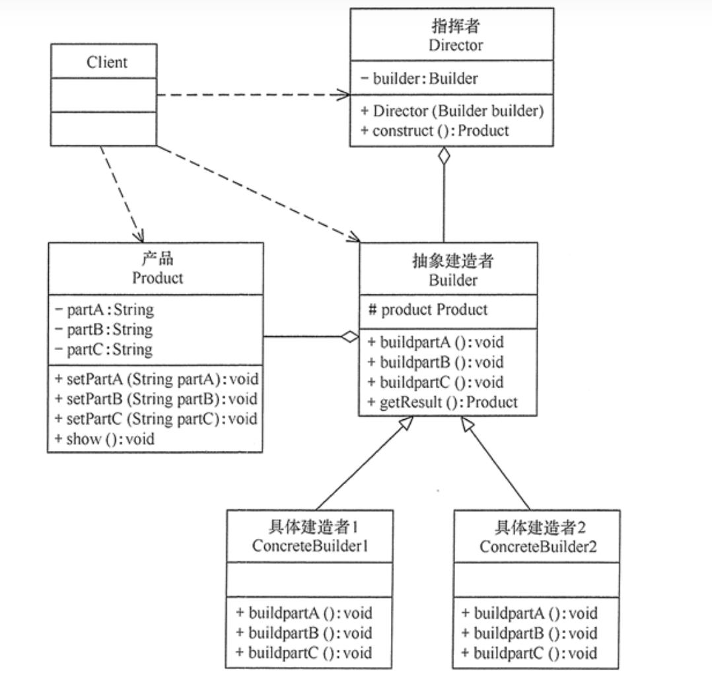

### [建造者模式（Builder Pattern）](#)

**介绍**：建造者（Builder）模式的定义：指将一个复杂对象的**构造**与它的**表示**分离，使**同样的构建过程可以创建不同的表示**，这样的设计模式被称为建造者模式。它是将一个复杂的对象分解为多个简单的对象，然后一步一步构建而成。它将变与不变相分离，即产品的组成部分是不变的，但每一部分是可以灵活选择的。

-----





### 1. 基本概念

#### 动机（Motivation）

- 在软件系统中，有时候面临着“一个复杂对象”的创建工作，其通常由各个部分的子对象用一定的算法构成；由于需求的变化，这 个复杂对象的各个部分经常面临着剧烈的变化，但是将它们组合在一起的算法却相对稳定。
- 如何应对这种变化？如何提供一种“封装机制”来隔离出“复杂对象的各个部分”的变化，从而保持系统中的“稳定构建算法”不随着需求改变而改变？


> 去肯德基，汉堡、可乐、薯条、炸鸡翅等是不变的，而其组合是经常变化的，生成出所谓的"套餐"。
>
> 与工厂模式的区别是：建造者模式更加关注与零件装配的顺序。


#### 模式定义

将一个复杂对象的构建与其表示相分离，使得同样的构建过程(稳定)可以创建不同的表示(变化)。 ——《设计模式》GoF


#### 四个角色：

* Product (产品角色) : 一个具体的产品对象。
* ConcreteBuilder (具体建造者) :实现接口，构建和装配各个部件。
* Builder (抽象建造者) :创建一 个Product对 象的各个部件指定的接口/抽象类。
* Director (指挥者) :构建一个使用Builder接 口的对象。它主要是用于创建一个复 杂的对象，它主要有两个作用，一是:隔离了客户与对象的生产过程，二是:负责控制产品对象的生产过程。


该模式的主要优点如下：

1. 封装性好，构建和表示分离。
2. 扩展性好，各个具体的建造者相互独立，有利于系统的解耦。
3. 客户端不必知道产品内部组成的细节，建造者可以对创建过程逐步细化，而不对其它模块产生任何影响，便于控制细节风险。

其缺点如下：

1. 产品的组成部分必须相同，这限制了其使用范围。
2. 如果产品的内部变化复杂，如果产品内部发生变化，则建造者也要同步修改，后期维护成本较大。

建造者（Builder）模式和工厂模式的关注点不同：建造者模式注重零部件的组装过程，而[工厂方法模式](https://link.zhihu.com/?target=http%3A//c.biancheng.net/view/1348.html)更注重零部件的创建过程，但两者可以结合使用。


### 2. 模式例子：

我们有一个 Computer类，他可能有不同的配置，可以选择不同的CPU、内存、硬盘！

```cpp
class Computer{
private:
    std::string _cpu;
    std::string _memory;
    std::string _disk;
public:

    [[nodiscard]] const std::string & get_cpu() const { return _cpu;}
    void set_cpu(const std::string& str_cpu) {  this->_cpu = str_cpu;}

    [[nodiscard]] const std::string & get_memory() const { return _memory;}
    void set_memory(const std::string& str_memory) {  this->_memory = str_memory;}

    [[nodiscard]] const std::string & get_disk() const { return _disk;}
    void set_disk(const std::string& str_disk) {  this->_disk = str_disk;}

    Computer() = default;
};
```


#### 创建抽象类 builder

```cpp
class ComputerBuilder{
protected:
    Computer computer;
public:
    virtual void builderCPU() = 0;    // 设置 
    virtual void builderMemory() = 0;
    virtual void builderDisk() = 0;
public:
    Computer builder(){
        return computer;
    }
};
```


#### 实现距离的builder 类

实现创建不同配置的Computer的builder类

```cpp
//基本配置
class BasicComputerBuilder: public ComputerBuilder{
    void builderCPU() override{
        this->computer.set_cpu("Intel I5-135000H");
    };

    void builderDisk() override{
        this->computer.set_disk("Samsung 512G SSD");
    };

    void builderMemory() override{
        this->computer.set_memory("Samsung 16G Memory");
    };

};

//高端配置
class AdvanceComputerBuilder: public ComputerBuilder{
    void builderCPU() override{
        this->computer.set_cpu("Intel i9-14900K 24 6 GHz");
    };

    void builderDisk() override{
        this->computer.set_disk("Samsung 2T SSD PCIe 4.0 x4 980 PRO ");
    };

    void builderMemory() override{
        this->computer.set_memory("KingSton 32G(16X2) Memory");
    };

};
```


#### 创建Director

```cpp
class ComputerDirector{
private:
    ComputerBuilder* _builder;
public:
    explicit ComputerDirector(ComputerBuilder* builder): _builder(builder){

    };
    Computer builder(){
        _builder->builderCPU();
        _builder->builderDisk();
        _builder->builderMemory();
        return _builder->builder();
    };
};
```


#### 测试：

```cpp
int main()
{
    //高配电脑
    AdvanceComputerBuilder builder;
    ComputerDirector director(&builder);
    Computer cmp = director.builder();

    std::cout << cmp.get_cpu() << std::endl;
    std::cout << cmp.get_disk() << std::endl;
    std::cout << cmp.get_memory() << std::endl;
};
```


### 要点：

- Builder 模式主要用于“分步骤构建一个复杂的对象”。在这其中“分步骤”是一个稳定的算法，而复杂对象的各个部分则经常变化。
- 变化点在哪里，封装哪里—— Builder模式主要在于应对“复杂对象各个部分”的频繁需求变动。其缺点在于难以应对“分步骤构建算法”的需求变动。

- 在Builder模式中，要注意不同语言中构造器内调用虚函数的差别（C++(构造函数中不可以调用虚函数) vs. C#)。