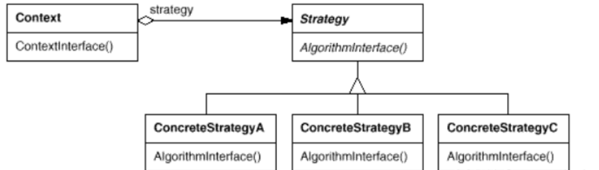

### [Strategy 策略模式](#)

**动机**： 在软件构建过程中，某些对象使用的算法可能多种多样，经常改变，如果将这些算法都编码到对象中，将会使对象变得异常复杂；而且有时候支持不使用的算法也是一个性能负担。

-----

如何在运行时根据需要透明地更改对象的算法？将算法与对象本身解耦，从而避免上述问题？


**意图**：定义一系列的算法,把它们一个个封装起来, 并且使它们可相互替换。

**主要解决**：在有多种算法相似的情况下，使用 if...else 所带来的复杂和难以维护。

在策略模式定义了一系列算法或策略，并将每个算法封装在独立的类中，使得它们可以互相替换。通过使用策略模式，可以在运行时根据需要选择不同的算法，而不需要修改客户端代码



**注意事项：**如果一个系统的策略多于四个，就需要考虑使用混合模式，解决策略类膨胀的问题。


#### 模式定义

定义一系列算法，把它们一个个封装起来，并且使它们可互相替换（变化）。该模式使得算法可独立于使用它的客户程序(稳定)而变化（扩展，子类化）。


**策略模式包含以下几个核心角色：**

- 环境（Context）：维护一个对策略对象的引用，负责将客户端请求委派给具体的策略对象执行。环境类可以通过依赖注入、简单工厂等方式来获取具体策略对象。
- 抽象策略（Abstract Strategy）：定义了策略对象的公共接口或抽象类，规定了具体策略类必须实现的方法。
- 具体策略（Concrete Strategy）：实现了抽象策略定义的接口或抽象类，包含了具体的算法实现。

```cpp
//策略模式 
#include <iostream>
using namespace std;

//抽象武器  策略基类（抽象的策略）
class WeaponStrategy {
public:
    virtual void UseWeapon() = 0;
};

//具体的策略使用匕首作为武器
class Knife :public WeaponStrategy {
public:
    virtual void UseWeapon() {
        cout << "使用匕首" << endl;
    }
};

//具体的策略使用AK47作为武器
class AK47 :public WeaponStrategy {
public:
    virtual void UseWeapon() {
        cout << "使用AK47" << endl;
    }
};

//具体使用策略的角色 
class Character {
public:
    WeaponStrategy* pWeapon;
    void setWeapon(WeaponStrategy* pWeapon) {
        this->pWeapon = pWeapon;
    }

    void ThrowWeapon() {
        this->pWeapon->UseWeapon();
    }
};


void test01() {
    Character* character = new Character;
    WeaponStrategy* knife = new Knife;
    WeaponStrategy* ak47 = new AK47;

    //用匕首当作武器
    character->setWeapon(knife);
    character->ThrowWeapon();

    character->setWeapon(ak47);
    character->ThrowWeapon();

    delete ak47;
    delete knife;
    delete character;
}

int main()
{
    test01();
}
```

