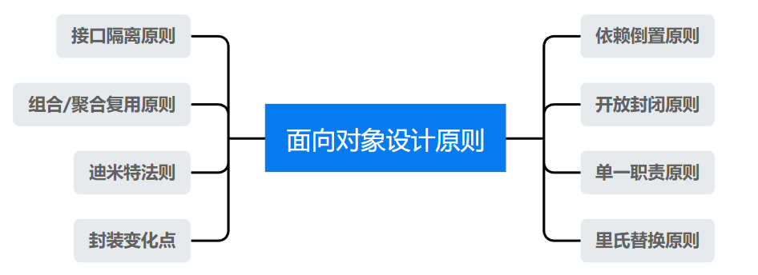
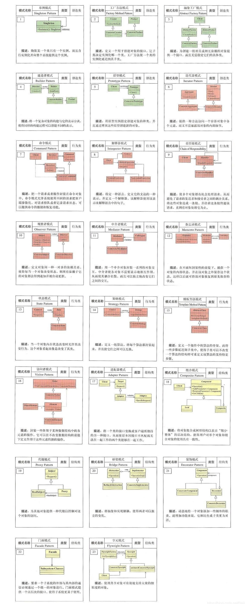

## [设计模式基本概念](#)

**介绍**:  **可复用的面向对象设计方法**即设计模式(英语 design pattern)是对**面向对象**设计中反复出现的问题的解决方案，每一个模式描述了一个在我们周围不断重复发生的问题以及该问题的解决方案的核心。这样，你就能一次又一次地使用该方案而不必重复劳动。


### [一、基本概念](#)

使用面向对象设计的原因就是抵御变化，当然完全容忍变化几乎是不可能的。

**对象**：从语言层面看对象是对数据和对数据操作的代码方法的封装，从规格层面看，对象是一系列可被使用的公共接口，从概念层面，对象是**某种拥有责任**的抽象。

**面向对象大三机制**：

* 封装：隐藏内部实现
* 继承：复用现有代码
* 多态：改写对象行为，分为重载和继承多态。

软件设计模式复杂性来源: 各种情况导致的**变化**， 解决方案有两种：分解、抽象。

**分解**：人们面对复杂性有一个常见的做法：即分而治之，将大问题分解为多个小问题，将复杂问题分解为多个简单问题。

**抽象**：更高层次来讲，人们处理复杂性有一个通用的技术，即抽象。由于不能掌握全部的复杂对象，我们选择忽视它的非本质细节而去处理[泛化](https://so.csdn.net/so/search?q=泛化&spm=1001.2101.3001.7020)和理想化了的对象模型。


**设计模式3大类** :

* 创建型模式（Creational Patterns）
  * 工厂方法模式、抽象工厂模式、单例模式、建造者模式、原型模式。

* 结构型模式（Structural Patterns）
  * 适配器模式、装饰器模式、代理模式、外观模式、桥接模式、组合模式、享元模式。

* 行为型模式（Behavioral Patterns）
  * 策略模式、模板方法模式、观察者模式、迭代子模式、责任链模式、命令模式、备忘录模式、状态模式、访问者模式、中介者模式、解释器模式。


### [二、 面向对象设计原则](#)

设计原则比设计模式更重要, 设计模式是尺，衡量一个模式的好坏。




**SOLID** 设计模式的六大原则有：

* Single Responsibility Principle：单一职责原则
* Open Closed Principle：开闭原则
* Liskov Substitution Principle：里氏替换原则
* Law of Demeter：迪米特法则
* Interface Segregation Principle：接口隔离原则
* Dependence Inversion Principle：依赖倒置原则
  

#### 2.1 依赖倒置原则

核心就两点：

* **高层模块模块(稳定)不应该依赖于底层模块(变化), 而应该依赖于抽象接口**
* **抽象(稳定)不应该依赖于实现细节(变化)，实现细节应该依赖于抽象(变化)**。

具体内容：针对接口编程，**依赖于抽象而不依赖于具体**。


#### 2.2 开放封闭原则

软件实体（类、模块、函数等）应该[对扩展开放，对修改封闭](#)。

**换句话说，当需求发生变化时，应该通过增加新的代码来扩展现有功能，而不是直接修改现有代码**。

假设我们有一个计算器程序，支持加、减、乘、除四种运算。现在要增加一种运算，mod运算, 我们可以通过继承原有的计算器类来实现，我们就实现了新的运算。但是，这种方式违反了开闭原则。**当我们需要添加新的运算时，必须修改已有的代码**，这样会增加代码的复杂度，也可能会引入新的错误。

```cpp
class Calculator{
public:
    int calculate(char op, const int& operand1 , const int& operand2){
        switch (op) {
            case '+':
                return operand1 + operand2;
            case '-':
                return operand1 - operand2;
            case '*':
                return operand1 * operand2;
            case '/':
                return operand1 / operand2;
            default:
                throw std::logic_error("no op");
        }
    }
};

class AdvancedCalculator: public Calculator{
public:
    int calculate(char op, const int& operand1 , const int& operand2) {
        switch (op) {
            case '+':
                return operand1 + operand2;
            case '-':
                return operand1 - operand2;
            case '*':
                return operand1 * operand2;
            case '/':
                return operand1 / operand2;
            case '%':
                return operand1 % operand2;
            default:
                throw std::logic_error("no op");
        }
    }
};
```

我们可以使用策略模式来遵循开闭原则, 为了代码简单我们使用函数指针凑合一下。

```cpp
int AddStrategy(const int& operand1 , const int& operand2){
    return operand1 + operand2;
}

int SubStrategy(const int& operand1 , const int& operand2){
    return operand1 - operand2;
}

int MultiplicationStrategy(const int& operand1 , const int& operand2){
    return operand1 * operand2;
}

int DivisionStrategy(const int& operand1 , const int& operand2){
    return operand1 / operand2;
}

int ModStrategy(const int& operand1 , const int& operand2){
    return operand1 % operand2;
}

class AdvancedCalculator: public Calculator{
public:
    typedef int(*Strategy)(const int&, const int&);

    int calculate(Strategy strategy , const int& operand1 , const int& operand2) {
        return strategy(operand1, operand2);
    }
};
```

#### 2.3 单一职责原则

单一职责原则：**一个类应该仅有一个变化的原因，该变化隐含了它的职责**，职责太多时会导致扩展时对代码东拉西扯，造成混乱。

#### 2.4 里氏替换原则

里氏代换原则: **任何基类可以出现的地方,子类一定可以出现**

简单来说就是：**子类可以扩展父类的功能,但不能改变父类原有的功能**。也就是说: 子类继承父类时,除添加新的方法完成新增功能外, **尽量不要重写父类的方法**。

#### 2.5 接口隔离原则

建立单一接口，不要建立庞大臃肿的接口，尽量细化接口，接口中的方法尽量少，**接口应该小而完备**，不该强迫用户使用多余的方法。

#### 2.6 组合/聚合复用原则

尽量使用组合和聚合少使用继承的关系来达到复用的原则，继承通常会让子类和父类的耦合度增加、组合的方式只要求组件具备良好定义的接口。

#### 2.7 封装变化点

使用封装来创建对象之间的**分界层**，让设计者可以在分界层的一侧进行修改，而不会对另一侧产生不良影响。从而实现松耦合。

隔离变化点的好处在于，将系统中经常变化的部分和稳定的部分隔离，有助于增加复用性，并降低系统耦合度。

#### 2.8 迪米特法则

定义：**一个软件实体应当尽可能少的与其他实体发生相互作用**，又叫针对接口编程，而不是针对实现编程。

针对接口编程，而不是针对实现编程，不降变量类型声明为某个特定的具体类，而是声明为某个接口。客户程序无需获取对象的具体类型，而是声明为某个接口。减少各系统之间的依赖，实现[**高内聚，松耦合**](#)。

最少知道原则的另一个表达方式是：只与直接的朋友通信。类之间只要有耦合关系，就叫朋友关系。耦合分为依赖、关联、聚合、组合等。我们称出现为成员变量、方法参数、方法返回值中的类为直接朋友。局部变量、临时变量则不是直接的朋友。我们要求陌生的类不要作为局部变量出现在类中。

#### **附录**： 



